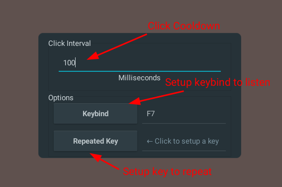

# XKeyClicker
Basically an XClicker, but with keyboard keys instead<br>


## Usage
Using it should be straight forward
1. Specify a cooldown (Default: 100ms)
2. Setup a keybind (Default: F7)
3. Setup the key to repeat<br><br>


## Installing
> I haven't tested this on Windows or Mac, but since GTK & rdev are cross-compatible, it *should* work<br>
### Compiling from source
Either you could clone this repo & build it with `cargo build --release` or you could simply do:
```sh
cargo install --git https://github.com/S0raWasTaken/XKeyClicker
``` 
That already moves your built binary to your cargo bin folder
### Using pre-built binaries
I haven't built binaries yet, but this option will be available in the future

## About
This project was inspired on [XClicker](https://github.com/robiot/xclicker), a mouse autoclicker for X11 (that also works on wayland last time I checked).<br><br>
Any weird stuff that happens or if you have any useful idea, please don't hesitate to open an issue!<br> 
I'll be happy to read it.
